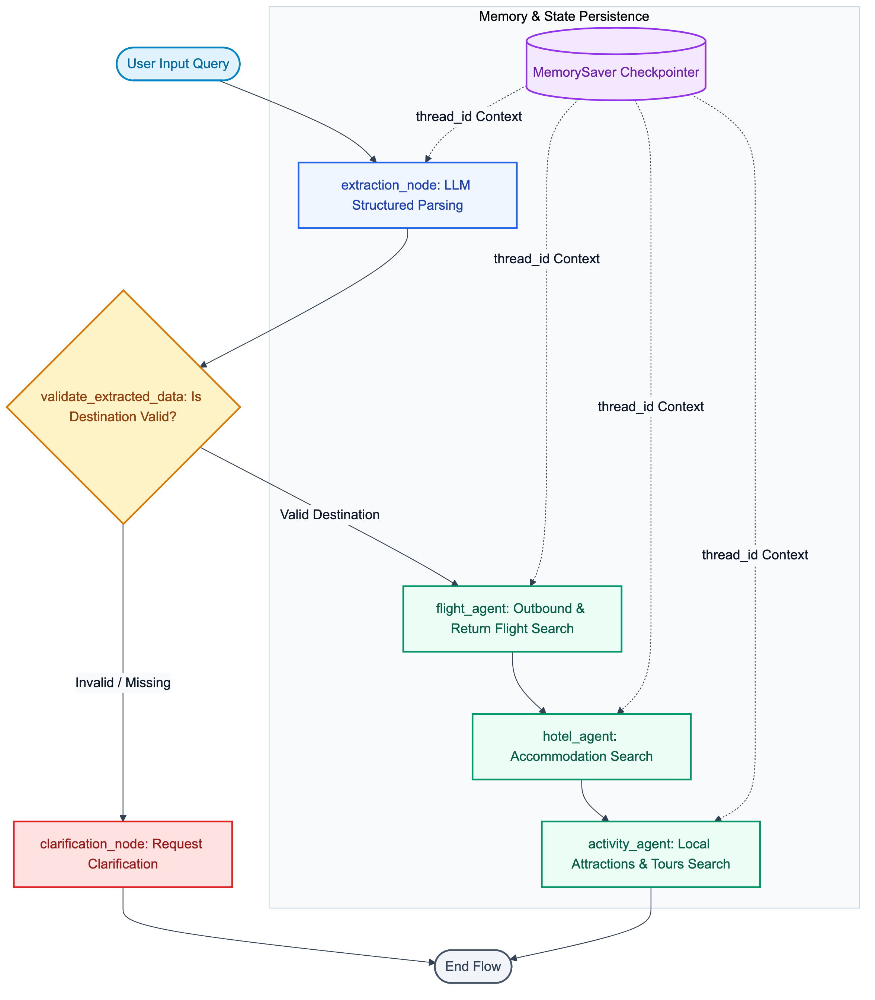

# ✈️ Agentic Travel Planner


🔗 **Vercel Live App**: [https://sanket-kakad-agentic-travel-booking.vercel.app/](https://sanket-kakad-agentic-travel-booking.vercel.app/)  
🔗 **Render Backup Service**: [https://sanket-kakad-agentic-travel-booking-app.onrender.com/](https://sanket-kakad-agentic-travel-booking-app.onrender.com/)

---

## 🎥 Application Demo

[](https://youtu.be/oMdAULxQ_HE)

▶️ **Watch full video demo on YouTube**: [https://youtu.be/oMdAULxQ_HE](https://youtu.be/oMdAULxQ_HE)

**Agentic Travel Planner** is an advanced, enterprise-grade AI travel planning ecosystem powered by a stateful multi-agent orchestration workflow built on FastAPI, LangGraph, and LangChain. The system automatically parses natural language travel queries, extracts structured itineraries (origin, destination, travel dates, budget), and coordinates a network of specialized AI agents to inspect, compare, and coordinate flights, hotel accommodations, and local activities. 

Featuring built-in JSON database-backed booking capabilities, real-time customer reviews retrieval, and automated LLM-generated travel itinerary summaries, it showcases the future of stateful, autonomous agentic service orchestration.

---

## 📐 Visual Architecture Diagram



---

## ✨ Core Capabilities

*   **Natural Language Processing**: Translates unstructured user prompts (e.g., *"Plan a 5-day cheap trip to Paris starting Sep 1st"*) into structured parameters using LLM-backed schema extraction.
*   **Stateful Agentic Orchestration**: Uses LangGraph to compile a workflow graph with `MemorySaver` state persistence (`thread_id`) and conditional edge validation routing.
*   **Layered Database Abstraction**: Connects to either external HTTP APIs or executes optimized direct-query local resolution against a static JSON database layer.
*   **Automated Summarization**: Uses generative AI completion to compile booked items (flights, hotels, activities) into a cohesive, highly personalized travel itinerary with markdown formatting and local destination tips.

---

## 📂 Architecture and Codebase Structure

The project follows a clean, decoupled directory structure separating route handling, business logic, data models, and database clients:

```
multi-agents-travel-booking-app/
├── .github/workflows/ci.yml        # GitHub Actions CI pipeline (linting & pytest)
├── app/
│   ├── main.py                     # Primary FastAPI application bootloader
│   ├── controllers/                # Travel planning & mock dataset API route handlers
│   ├── database/                   # Core dataset store (flights, hotels, bookings)
│   ├── models/                     # Pydantic validation & LangGraph state schemas
│   ├── repositories/               # Database access layer abstraction
│   └── services/
│       └── agent_service.py        # LangGraph workflow compiler, state checkpointer & agent nodes
├── frontend/                       # React SPA client code & modular components
├── static/                         # Production static assets served by FastAPI
├── tests/                          # Automated Pytest suite (API endpoints & agent nodes)
├── Dockerfile                      # Multi-stage production build configuration
├── LICENSE                         # MIT open-source license
├── README.md                       # Documentation & visual architecture diagram
├── pyproject.toml                  # Dependencies & pytest configuration
└── uv.lock                         # Package resolution lockfile
```

---

## 🛠️ Step-by-Step Local Setup

### 1. Prerequisites
*   Python 3.12 or higher.
*   A Groq API Key (Sign up and get one for free on the [Groq Console](https://console.groq.com/)).

### 2. Configure Environment Variables
Create a `.env` file in the root directory:
```env
GROQ_API_KEY=your_groq_api_key_here
PORT=8000
USE_LOCAL_MOCK=true
```

### 3. Install Dependencies
Run the following command using the fast `uv` package manager:
```bash
# Install uv if you haven't already
pip install uv

# Sync project dependencies
uv sync
```

### 4. Start the Application
Run the Python entrypoint script:
```bash
uv run python app.py
```
The server will start on `http://localhost:8000`.

### 5. Run Automated Tests
Execute the Pytest test suite for API endpoints, Pydantic schemas, and LangGraph workflow nodes:
```bash
uv run pytest
```

---

## 🔌 API Endpoints Reference

### 🚀 Travel Agent Workflow API

| Method | Endpoint | Description |
| :--- | :--- | :--- |
| `POST` | `/api/travelplan` | Submits natural language queries to the compiled LangGraph workflow. |
| `POST` | `/api/book` | Makes a database reservation booking for a flight, hotel, or activity. |
| `GET` | `/api/reviews/{item_id}` | Retrieves real-time customer reviews for a flight, hotel, or activity. |
| `POST` | `/api/generatesummary` | Compiles a structured markdown summary itinerary of the booked selections. |
| `GET` | `/api/health` | Service health status check. |

---

### 🗄️ Integrated Database Mock API

These endpoints execute local JSON queries against `app/database/db.json` when `USE_LOCAL_MOCK=true` is set:

| Method | Endpoint | Query Parameters | Description |
| :--- | :--- | :--- | :--- |
| `GET` | `/mock-api/flights/available_flights` | `origin`, `destination`, `minPrice`, `maxPrice` | Filters and retrieves available flight entries. |
| `GET` | `/mock-api/hotels/available_hotels` | `city`, `rating`, `minPrice`, `maxPrice` | Filters and retrieves hotel accommodations. |
| `GET` | `/mock-api/thingsToDo/available_activities` | `city` | Retrieves destination activities. |
| `GET` | `/mock-api/bookings/active_bookings` | None | Lists all active client bookings. |
| `POST` | `/mock-api/book` | None *(Payload: `name`, `itemId`)* | Submits a reservation booking to the database. |

---

## 🐳 Production Deployment

### Container Run via Docker
```bash
docker run -d \
  -p 8000:8000 \
  -e GROQ_API_KEY="your_groq_api_key" \
  -e USE_LOCAL_MOCK="true" \
  --name travel-planner \
  sanketkakad/agentic-travel-planner:latest
```
